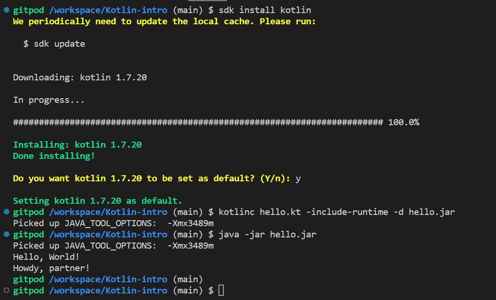

# Kotlin-intro
Trying out Kotlin programming language

How to run Kotlin in the Terminal:
  - sdk install kotlin

subsequent runs:

  - kotlinc hello.kt -include-runtime -d hello.jar
  - java -jar hello.jar

